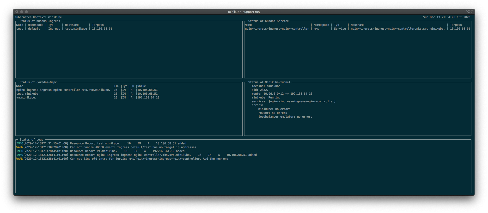

# How to start

[TOC]: # "## Table of Contents"

## Table of Contents
- [Installing `minikube-support`](#installing-minikube-support)
- [Setup your minikube cluster](#setup-your-minikube-cluster)
- [Allowing access to cluster](#allowing-access-to-cluster)
- [Installing your deployments](#installing-your-deployments)


## Installing `minikube-support`

Just download the
[latest releases](https://github.com/qaware/minikube-support/releases/latest)
unpack it and place it anywhere in our `PATH` for example in
`/usr/local/bin`.

Alternative you can install it using brew tap:

```shell script
brew install qaware/minikube-support/minikube-support  
```

## Setup your minikube cluster

To setup your minikube cluster you must have minikube already installed.
Then you can run `minikube start` to create a new cluster. After your
cluster is started you can use it like any other kubernetes cluster. And
you can setup your support tools.

The first run might be always a `minikube-support install -l` which will
install all tools, including all local tools.

## Allowing access to cluster

After installing all the tools you can run `minikube-support run` to see
the dashboard: 

This also starts the `coredns` server and `minikube tunnel` to allow
requests to loadbalancer services.

## Installing your deployments

Now you can install your own deployments including ingresses and
load balanced services. We provide a small demo deployment which shows
everything provided by the Minikube-Support Tools. You can install it by
simply running `kubectl apply -f https://raw.githubusercontent.com/qaware/minikube-support/master/docs/demo-deployment.yaml`.

When opening <https://test.minikube> you should see the Nginx
welcome-page, and you should not be requested to verify any TLS
certificates. Additionally, you should see the domain `test.minikube` in
the Minikube-Support Dashboard.
